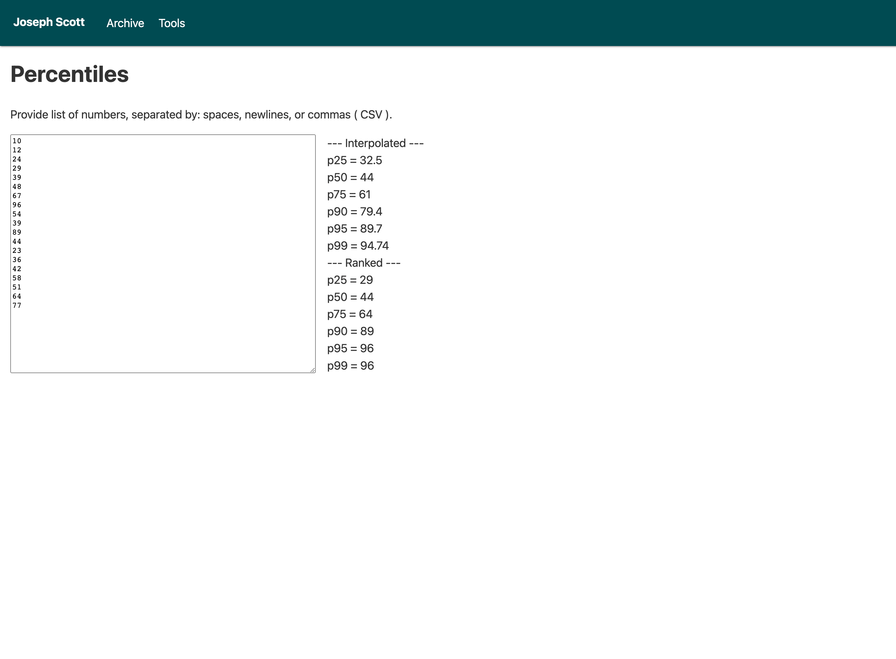

On a semi-regular basis I find myself with a set of numbers and want an easy to way to get percentile values for them.  Google Sheets does a great job with that, but I don't need a full spreadsheet for something so transitory.

All I really want is the percentile values.

That led me to add a tool to this site: [percentiles](https://josephscott.org/tools/percentiles/).  It is about as simple as it gets, a single auto focused textarea input.  Provide a list of numbers separated by spaces, newlines, or commas ( CSV ) and a bit of JavaScript will automatically calculate the 25th, 50th ( median ), 75th, 90th, 95th, and 99th percentiles.

I couldn't decide if I wanted values using the nearest ranked method, which provides percentile values picked from the numbers in the given set.  Or the interpolated approach which calculates what the percentile value would be.  So I did both.

All of the calculations are done on page with JavaScript, nothing gets sent to the server.  If you view source on [https://josephscott.org/tools/percentiles/](https://josephscott.org/tools/percentiles/) and scroll to the bottom you will see the 62 lines of code that do all of the work.  Nothing exciting, but it does the job I was looking for.
