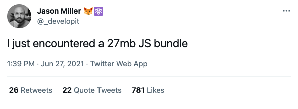

In February 2021 [Remy Sharp](https://remysharp.com/) captured the feelings of many web developers in: [The web didn't change; you did](https://remysharp.com/2021/02/11/the-web-didnt-change-you-did) :

> I keep reading how there was once a time that you could just write some PHP and HTML and hit refresh and you'd see the fruits of your efforts.
>
> How you could drop in jQuery and things were easier, and now the complicated web is here, and it's here to stay.
>
> Dear reader - let me ask you this, and I hope you ask your colleagues the same: **what's stopping you from using *exactly* method today?**.
>
> I say: nothing.

In theory we are all constantly weighing the value of additonal complexity and size with the benefits they are supposed to bring.  In practice too often the complexity and size are brought in for our own comfort rather than for the end user experience.

That is how you end up with [a 27 megabyte bundle of JavaScript](https://twitter.com/_developit/status/1409234922703835144) on a page.

With very few exceptions I think we can easily agree that a 27 MB JavaScript bundle is too big.

Our web sites are what we choose for them to be.  Each person and company could have different requirements, while having a common demonator: the web wins because of the potential to reach around the world.  We decide if we want to preserve that reach, or narrow it.

I like the way [Alex Russell put it](https://infrequently.org/2021/03/the-performance-inequality-gap/):

> when we construct the digital world to the limits of the best devices, we build a less usable one for 80+% of the world's users.

No matter how fast the latest iPhone or Android is, no matter how fast the latest WiFi and mobile specifications get, they will never be evenly distributed.  Deciding to preserve the reach of the web demands that we build it with that reach in mind.

In 2021 I still believe there is an important place for the **World Wide Web**.
